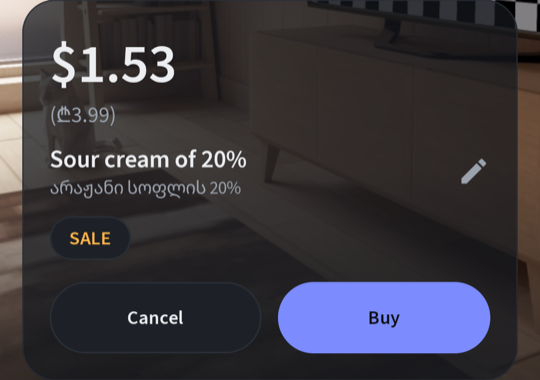
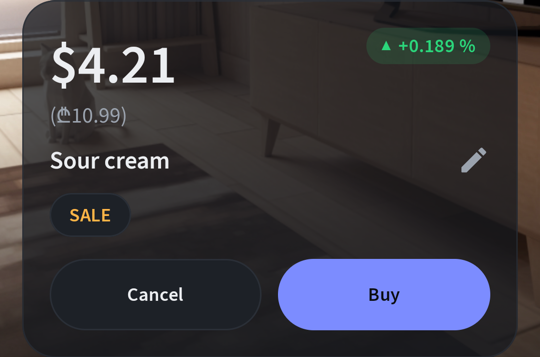
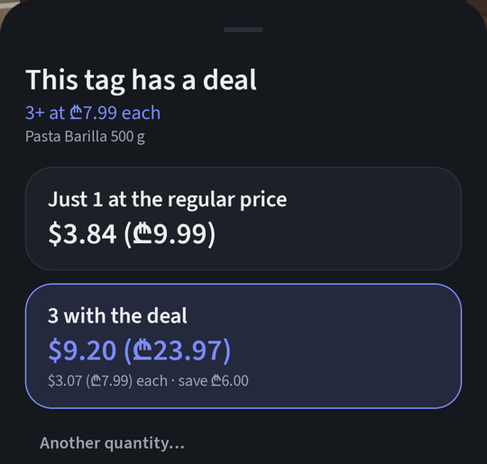
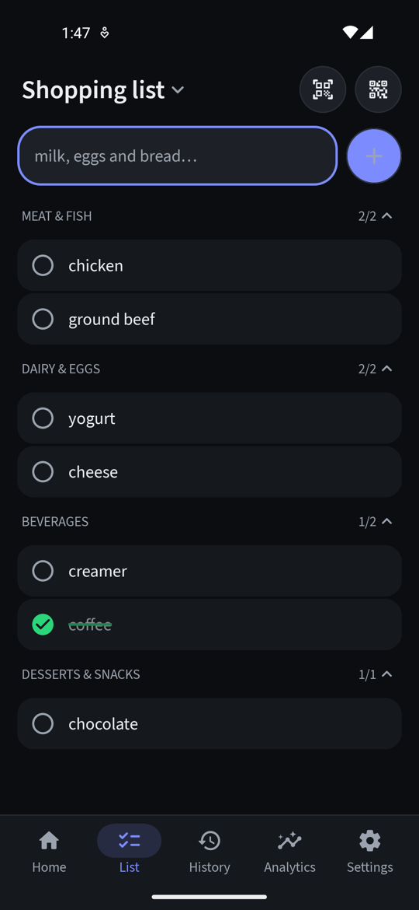
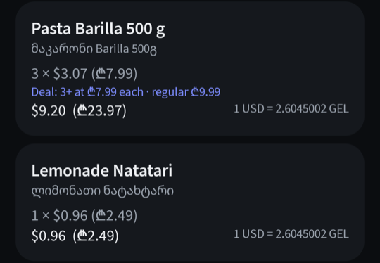

# Parity

**Parity - a price converter and exchange rate tracker for expats and nomads.**

Point your phone at a price tag abroad and see what it costs in *your* currency, with the local
price beside it in brackets. Parity reads the label, translates the product name, keeps a running
total of your basket, and records every shop. It also watches the exchange rate. Every time you
scan something you've seen before, it shows whether your money now buys more or less than last
time.

> **Beta · Android only.** Download the APK from
> [Releases](https://github.com/Orthobro83/parity/releases). An iPhone version is planned.

<p align="center">
  
  
  
</p>

## Features

### Scan, convert, understand
- **Scan price tags** with the camera. The price locks in once it reads the same in several frames.
  You can also scan a photo from your gallery, or type a price in.
- **Your currency first:** the converted price is shown large, with the shelf price in brackets:
  **$3.84 (₾9.99)**. Over 150 fiat currencies plus 19 cryptocurrencies (BTC, ZEC, ETH, XMR and
  more).
- **Knows where you are.** It detects the country from location, or from the mobile network when
  location is off, and switches the local currency automatically. You can always set it by hand.
- **Reads and translates labels on the phone.** Latin-script labels are read by ML Kit. Georgian
  and Cyrillic labels are read by Tesseract. Product names are translated into your language
  offline once the language pack is downloaded.
- **Spots sales** ("-20%", "ფასდაკლება", "скидка", "was 12.49") and keeps the pre-sale price, so
  price history isn't distorted by promotions. A **SALE** chip lets you correct it.
- **Handles multi-buy deals:** "3+ at ₾7.99 each", "3 for $10", "1+1", "2nd at 50% off", "2/$5".
  When you tap Buy, Parity asks: *just 1 at the regular price*, or *the deal quantity at the deal
  price*. Your answer is saved with the purchase.

### ▲ / ▼ — how your money is doing
Scan a product you've scanned before and Parity compares the exchange rate then and now.
- 🟢 **▲** Your currency buys more local currency than last time (the local currency weakened).
- 🔴 **▼** Your currency buys less (the local currency strengthened).

There's no threshold, so even a 0.01 % move shows. Tap the badge to see both rates to full
precision, and the shelf-price change kept separate from the currency effect. Rates can come from
six providers, from daily (free, no key) to minute-level (CoinGecko).

### Shop
- **Running total** at the top in both currencies. Each item keeps the rate it was scanned at, so
  the total doesn't drift while you shop.
- **Cart:** tap the total to adjust quantities, or swipe an item right to remove it (with Undo).
- **Finalize** saves the trip. If items on your shopping list are still unbought, Parity lists
  them and asks: *Keep Shopping* or *Finalize purchases*.

### Plan
- **Shopping list:** type naturally ("chicken, ground beef, coffee, creamer, chocolate, yogurt, and
  cheese") and Parity sorts it into aisles: Meat & Fish, Beverages, Desserts & Snacks, Dairy and so
  on. Items get a green line through them when checked off, including automatically when you buy
  a matching product.
- **Share a list by QR code.** A short list fits in one code ("1 of 1"). Longer data cycles
  through numbered codes ("2 of 4") until the other phone has them all.

### Look back
- **History:** every trip with its date, store, items, and prices in both currencies. Search by
  year, month or day, and rename stores ("Store 1" → "Carrefour, Tbilisi Mall").
- **Analytics:** how your currency has moved against each local currency since your first scan.
  For each product, the price change is split into *shelf price* and *currency effect*, with sales
  excluded. Charts are coming.

### Your data stays yours
- No account and no tracking. Everything is stored on your phone. The network is only used for
  exchange rates and one-time translation language packs.
- **Export** everything as a ZIP of CSV files (plus a simple `purchases.csv` for spreadsheets), and
  **restore** by merging or replacing.
- **Move everything to a new phone** with cycling QR codes, encrypted with a 12-character code
  shown on the sending phone.

<p align="center">
  
  
</p>

## Install

1. Open [Releases](https://github.com/Orthobro83/parity/releases) on your phone and download:
   - `Parity-…-arm64-v8a.apk` for almost every phone from the last several years, or
   - `Parity-…-armeabi-v7a.apk` for older 32-bit phones.
2. Open the file. If Android asks, allow **Install unknown apps** for your browser.
3. Parity needs **Android 8.0 or newer**. It asks for the camera, and optionally for location.

Updating to a newer release keeps your data. To check a download is genuine, compare its signing
certificate with the SHA-256 fingerprint listed in the release notes.

## Beta notes

- Tested on an Android emulator, with realistic generated price tags in Georgian, English and
  Russian, and on one real phone. Real shelves vary (glare, angles, store fonts), so please report
  tags it misreads.
- Product names are read in Latin, Georgian and Cyrillic scripts. Elsewhere (for example Arabic,
  Hebrew, Thai, Chinese, Japanese, Korean) prices still work, but type the name yourself.
- The default rate provider updates daily, so two scans on the same day show "=". Pick CoinGecko
  in Settings for minute-level rates.
- Coming: analytics charts, more OCR scripts, and an iPhone version.

## Build from source

Requirements: JDK 17 or newer (Android Studio's bundled one works) and the Android SDK with
platform 37.

```bash
git clone https://github.com/Orthobro83/parity.git
cd parity
echo "sdk.dir=$HOME/Library/Android/sdk" > local.properties   # your SDK path
./gradlew :core:jvmTest                  # unit tests
./gradlew :androidApp:assembleDebug      # APKs in androidApp/build/outputs/apk/debug/
```

| Module | What's in it |
|---|---|
| `core` | Pure Kotlin: money and currencies, the price-tag parser, sales and multi-buy detection, the ▲/▼ maths, list classification, QR transfer framing, encryption, CSV |
| `shared` | Kotlin Multiplatform: Room database, exchange-rate providers, app logic, and the Compose Multiplatform UI |
| `androidApp` | CameraX, ML Kit (text, barcodes, language ID, translation), Tesseract, location, file picker |

The full design is in [design.md](design.md), and build notes are in [PROGRESS.md](PROGRESS.md).

## License

Parity is **source-available, not open source**. It is licensed under the
[PolyForm Strict License 1.0.0](LICENSE): you may read the code and use the app for personal,
noncommercial purposes. You may not redistribute it, change it, or build new works based on it.
Commercial use needs permission.

Bundled third-party files keep their own licenses: Source Sans 3 (SIL Open Font License) and
Tesseract language data (Apache 2.0). See [third_party/](third_party).

Bug reports and ideas are welcome in [Issues](https://github.com/Orthobro83/parity/issues).
